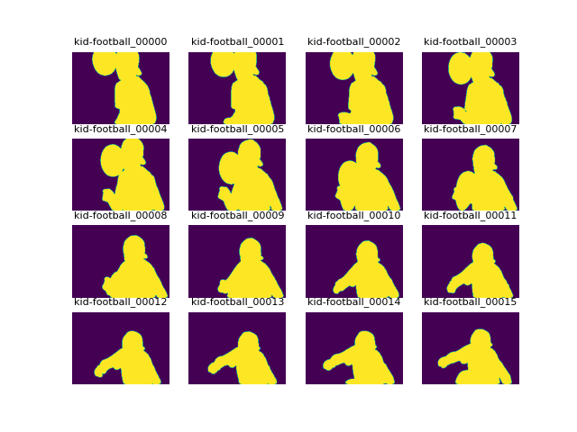
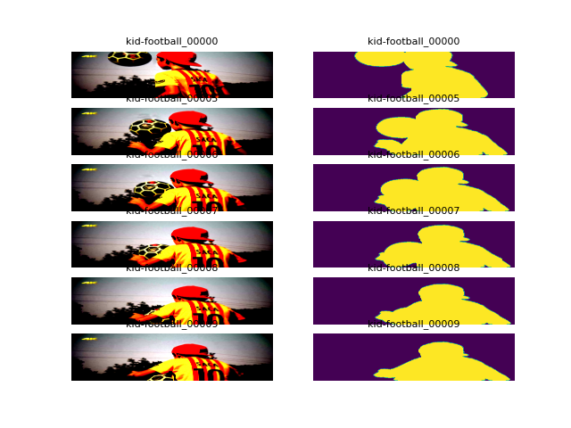

# davis
- [x] Added vanilla supervised training code. 
- [x] Added semi-supervised training code. 
- [x] Fix bugs in the dataloader. As of now, its merging the images of all the classes. But the images should be loaded at the class level to retain the temporal information.  
- [ ] Add augmentations
- [ ] Add Online Training 

#### GT masks
 

#### Coarsed and translated masks
 

#### Input image + masks 
 

